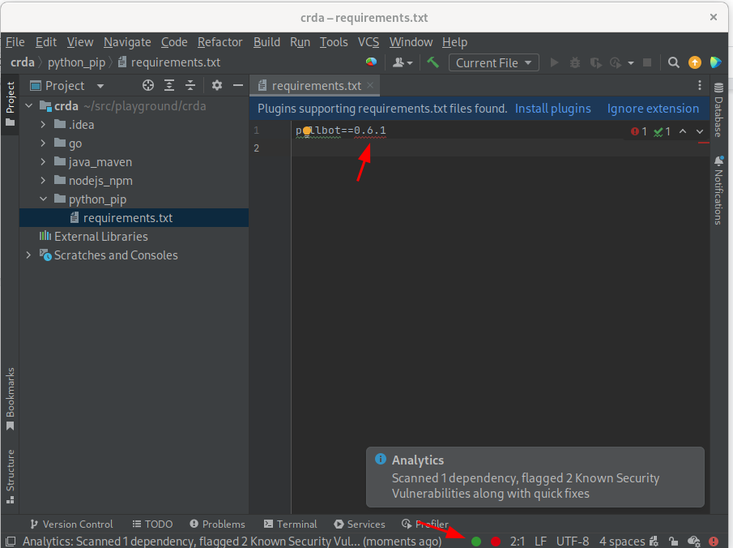
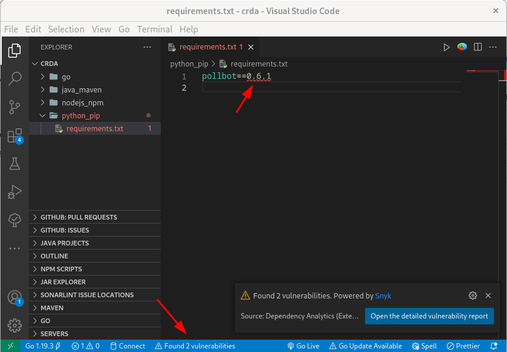
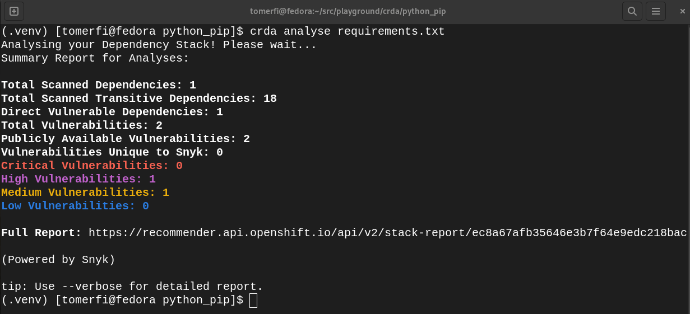
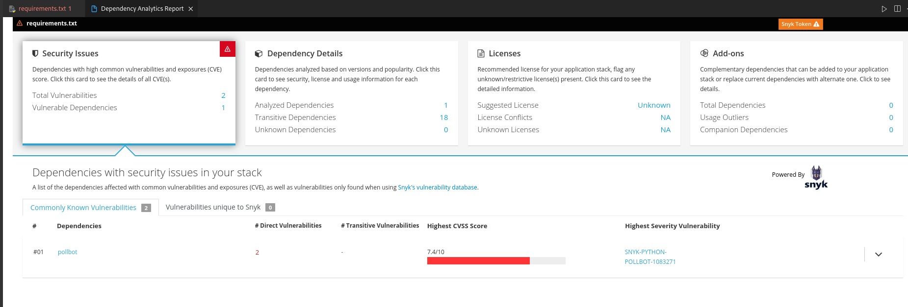

<h1>Python - PIP Project Red Hat CodeReady Analytics</h1>

<h2>Component Analysis</h2>

<h3>Rich language features for IntelliJ (LSP Server)</h3>

<h3>Rich language features for VSCode (LSP Server)</h3>

<h2>Stack Analysis</h2>

<h3>Stack Analysis report using the CLI</h3>

In IDEs, for <em>Stack Analysis Reports</em> select the desired ecosystem file. 
Either right click the file, open the file menu, right click in-file, or click the summary report panel at the bottom, 
than select <strong>Dependency Analytics Report</strong>. 

Or simply click the  icon.

<h3>Stack Analysis report IntelliJ</h3>
<!-- 

 -->

TODO - Add image for IntelliJ Python PIP stack analysis report

<h3>Stack Analysis report VSCode</h3>

